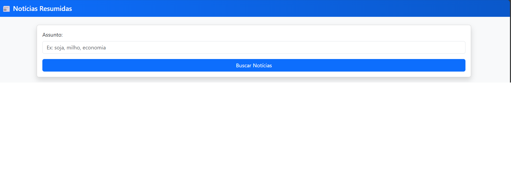
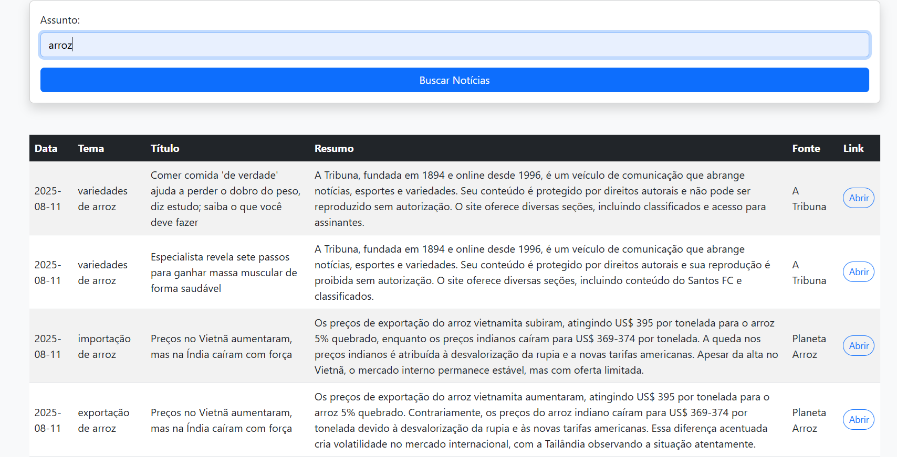
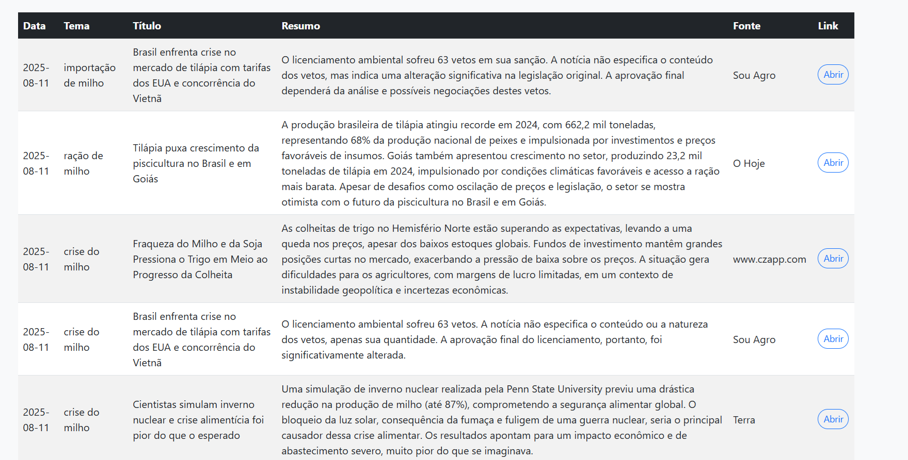

# InfoResumo-News
Este projeto de ciência de dados utiliza o poder do modelo Gemini para automatizar a busca, sumarização e apresentação de notícias. O objetivo é fornecer ao usuário uma ferramenta que, a partir de um assunto de interesse, pesquisa e exibe as notícias mais relevantes do dia de forma concisa e organizada.

## 🚀 Funcionalidades
### Geração de Palavras-chave com o Gemini
Ao receber o assunto de pesquisa do usuário, a aplicação consulta o modelo Gemini para gerar uma lista de palavras-chave relacionadas. Esse processo enriquece e otimiza a busca, garantindo resultados mais relevantes e abrangentes.

### Busca e Extração de Notícias
Com as palavras-chave geradas, a aplicação utiliza a biblioteca GoogleNews para buscar os artigos mais recentes do dia. Em seguida, a biblioteca BeautifulSoup é empregada para extrair todo o conteúdo textual de cada notícia, preparando-o para a etapa de resumo.

### Resumo Automático com o Gemini
O conteúdo completo de cada notícia é processado pelo modelo Gemini, que a resume em no máximo três frases, destacando as informações mais importantes. Isso permite que o usuário entenda rapidamente o que é relevante em cada artigo.

### Interface Web
A aplicação conta com uma interface web desenvolvida com o framework Flask, oferecendo uma experiência simples e intuitiva.

## 💻 Demonstração de Uso
Barra de Pesquisa
O usuário insere um assunto de interesse na barra de pesquisa, como, por exemplo, "soja", "milho" ou "economia".

## Visualização dos Resultados
Após clicar em "Buscar Notícias", a aplicação exibe uma tabela com os resultados. Para cada notícia, são apresentadas as seguintes informações:

Data: Data de publicação da notícia.

Tema: Palavra-chave sugerida pelo Gemini que gerou a notícia.

Título: Título original da notícia.

Resumo: Resumo da notícia, feito pelo Gemini em até três frases.

Fonte: Nome do veículo de comunicação.

Link: Botão "Abrir" que direciona para a notícia completa.

Exemplo de Pesquisa: "arroz"

Exemplo de Pesquisa: "soja"
